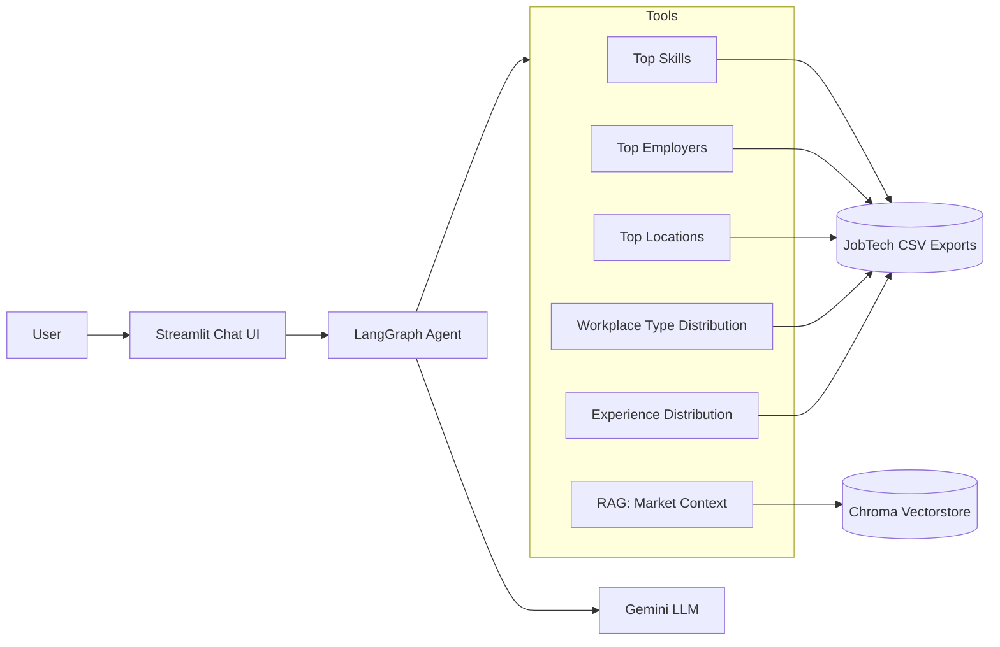

# Swedish AI/Data Job Market Assistant

A conversational assistant that answers questions about the Swedish AI/Data job market using a
LangGraph agent, structured data tools, and RAG.

## Project Workthrough

- **Agent design with tool-calling** — a LangGraph agent that selects between six tools based on the user's question, rather than a single fixed prompt-to-answer pipeline
- **Retrieval-augmented generation (RAG)** — a local Chroma vectorstore over project documentation, used for open-ended "why/how" questions a structured query can't answer
- **Evaluation & observability** — a LangSmith-based evaluation pipeline that scores tool-selection correctness across structured, RAG, multi-tool, and edge-case questions
- **Containerization** — a Docker setup for reproducible deployment, independent of local environment quirks


## Architecture



The agent receives a user question, decides which tool(s) it needs (one, several, or none), calls them, and synthesizes a final answer. 
Five tools query a pandas-backed dataset of collected job postings; a sixth performs similarity search over project documentation for open-ended questions.

## Tech Stack

- **Agent framework:** LangChain + LangGraph
- **LLM:** Google Gemini via `langchain-google-genai`
- **Vector store:** Chroma, persisted locally
- **Embeddings:** HuggingFace `all-MiniLM-L6-v2`
- **Frontend:** Streamlit
- **Evaluation & tracing:** LangSmith
- **Data source:** [JobTech API](https://jobtechdev.se/) — see the companion data-pipeline repo: [swedish-job-market-analytics](https://github.com/Denillox/swedish-job-market-analytics)

## Setup & Running Locally

```bash
git clone https://github.com/Denillox/swedish-job-market-assistant.git
cd swedish-job-market-assistant

python -m venv venv
venv\Scripts\activate
pip install -r requirements.txt
```

Create a `.env` file in the project root:
GOOGLE_API_KEY=your_key_here

Run the app:

```bash
streamlit run app/main.py
```

> **Note:** on first run, the assistant builds a local Chroma vectorstore from project documentation using HuggingFace embeddings. This happens once and is persisted to disk for subsequent runs.


## Running with Docker

Build the image:

```bash
docker build -t swedish-job-market-assistant .
```

Run the container, passing your Gemini API key via the `.env` file:

```bash
docker run --env-file .env -p 8501:8501 swedish-job-market-assistant
```

## Evaluation

The project includes a LangSmith evaluation pipeline (`tests/run_evaluation.py`) that runs a fixed set of questions 
(`tests/eval_questions.json`) against the agent and scores whether it called the expected tool(s) for each one. Questions span:

- **Structured tool** queries (e.g. "What are the top skills for data engineer roles?")
- **RAG** queries (e.g. "How was this dataset collected?")
- **Multi-tool** queries that should combine structured data with contextual commentary
- **Edge cases** — roles or regions with sparse or no matching data, testing graceful handling

Run it with:

```bash
python tests/run_evaluation.py
```

## Known Limitations

- The underlying dataset is a **snapshot** of job postings collected at a point in time, not a live feed of current openings.
- Skill, workplace-type, and experience-requirement detection are based on keyword/regex patterns, not perfect classification meaning counts should be read as "detected mentions," not an exhaustive census.
- Only a minority of job postings state an explicit years-of-experience requirement; the experience-distribution tool reports this explicitly rather than silently ignoring the gap.